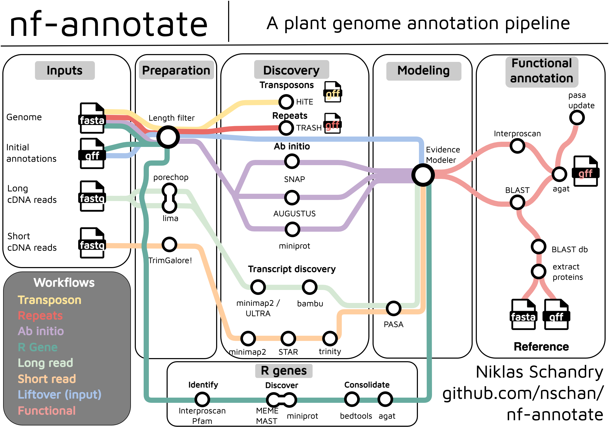
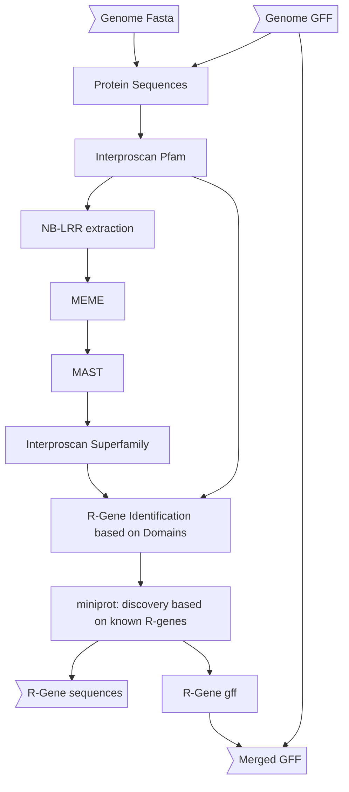
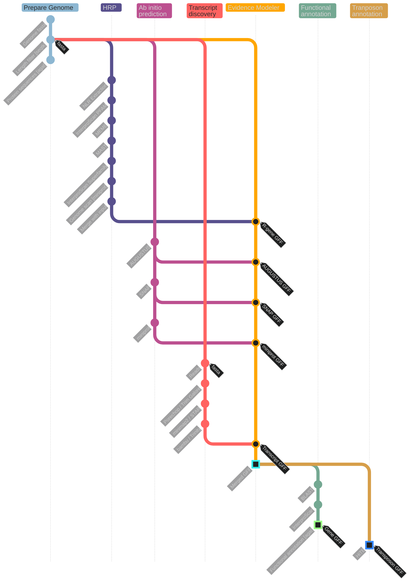

[](https://zenodo.org/doi/10.5281/zenodo.12759772)

The goal of [`genomeassembler`](https://github.com/nschan/genomeassembler) and [`nf-annotate`](https://github.com/nschan/nf-annotate) is to make to genome assembly and annotation workflows accessible for a broader community, particularily for plant-sciences. Long-read sequencing technologies are already cheap and will continue to drop in price, genome sequencing will soon be available to many researchers without a strong bioinformatic background. 
The assembly is naturally quite organisms agnostic, but the annotation pipeline contains some steps that may not make sense for other eukaryotes, unless there is a particular interest in NB-LRR genes.

# nf-arannotate



The current recommended workflow for assembly and annotation of _Arabidopsis_ from long reads is:

  * Assembly: [`genomeassembler`](https://github.com/nschan/genomeassembler)
  * Annotation: This pipeline.

This pipeline is designed to annotate outputs from [`nf-genomeassembly`](https://github.com/nschan/nf-genomeassembly).
It takes a samplesheet of genome assemblies, intitial annotations (liftoff) and *cDNA* ONT Nanopore reads or pacbio isoseq reads. If no long transcriptome reads are available short reads can also be used.

If `--short_reads` is `true` the pipeline takes short reads instead of long cDNA. This is probably better than no reads, but for high-quality annotations long transcriptome reads are recommended.

# Usage

To run the pipeline with a samplesheet on biohpc_gen with charliecloud:

```
git clone https://github.com/nschan/nf-annotate
nextflow run nf-annotate --samplesheet 'path/to/sample_sheet.csv' \
                          --out './results' \
                          -profile biohpc_gen
```

# Parameters

| Parameter | Effect |
| --- | --- |
| `--samplesheet` | Path to samplesheet |
| `--preprocess_reads` | Run `porechop` on ONT reads or [`LIMA`-`REFINE`](https://isoseq.how/getting-started.html) on pacbio reads? (default: `false`) |
| `--exclude_pattern` | Exclusion pattern for chromosome names (HRP, default `ATMG`, ignores mitochondrial genome) |
| `--reference_name` | Reference name (for BLAST), default: `Col-CEN` |
| `--reference_proteins` | Protein reference (defaults to Col-CEN); see known issues / blast below for additional information |
| `--gene_id_pattern` | Regex to capture gene name in initial annoations. Default: ` "AT[1-5C]G[0-9]+.[0-9]+|evm[0-9a-z\\.]*|ATAN.*" ` will capture TAIR IDs, evm IDs and ATAN  |
| `--r_genes` | Run R-Gene prediction pipeline?, default: `true` |
| `--augustus_species` | Species to for agustus, default: `"arabidopsis"` |
| `--snap_organism` | Model to use for snap, default: `"A.thaliana"` |
| `--mode` | Specify `'ont'` or `'pacbio'`. Default `'ont'` |
| `--aligner` | Aligner for long-reads. Options are `'minimap2'` or `ultra`. Default: `'minimap2'` |
| `--pacbio_polya` | Require (and trim) polyA tails from pacbio reads? Default: `true` |
| `--primers` | File containing primers used for pacbio sequencing (required if `--mode` is 'pacbio'). Default : `null` |
| `--short_reads` | Provide this parametere if the transcriptome reads are short reads (see below). Default: `false` |
| `--bamsortram` | *Short-reads only*: passed to STAR for `--limitBAMsortRAM`. Specifies RAM available for BAM sorting, in bytes. Default: `0` |
| `--min_contig_length` | minimum length of contigs to keep, default: 5000 |
| `--transpososons` | Annotate transposons, default `true` |
| `--satellites` | Annotate satellites, default `true` |
| `--out` | Results directory, default: `'./results'` |

# Samplesheet

Samplesheet `.csv` with header:

```
sample,genome_assembly,liftoff,reads
```

| Column | Content |
| --- | --- |
| `sample` | Name of the sample |
| `genome_assembly` | Path to assembly fasta file |
| `liftoff` | Path to liftoff annotations |
| `reads` | Path to file containing cDNA reads |

If `--short_reads` is used the samplesheet should look like:

```
sample,genome_assembly,liftoff,paired,shortread_F,shortread_R
sampleName,assembly.fasta,reference.gff,true,short_F1.fastq,short_F2.fastq
```

| Column | Content |
| --- | --- |
| `sample` | Name of the sample |
| `genome_assembly` | Path to assembly fasta file |
| `liftoff` | Path to liftoff annotations |
| `pair` | `true` or `false` depending on whether the short reads are paired |
| `shortread_F` | Path to forward reads |
| `shortread_R` | Path to reverse reads |

> If there is only one type of read shortread_R should remain empty and paired should be `false`

> NB: It is possible to mix paired and unpaired reads within one samplesheet, e.g. when performing annotation of many genomes with heterogenious data availability.

> NB: It is *not* possible to mix long and short reads in a single samplesheet.

# Procedure

This pipeline will run the following subworkflows:
  
  * `SUBSET_GENOMES`: Subset to genome to `params.min_contig_length`
  * `SUBSET_ANNOTATIONS`: Subset input gff to contigs larger than `params.min_contig_length`
  * `HRP`: Run the [homology based R-gene prediction](https://github.com/AndolfoG/HRP)
  * `AB_INITIO`: Perform ab initio predictions:
    - `SNAP` https://github.com/KorfLab/SNAP/tree/master
    - `AUGUSTUS` https://github.com/Gaius-Augustus/Augustus (kind of paralellized)
    - `MINIPROT` https://github.com/lh3/miniprot
  * `BAMBU` (long cDNA reads): Run `porechop` (optional) on cDNA reads. These reads are aligned via `minimap2` in `splice:hq` mode or using `uLTRA`, depending on the value of `params.aligner`. Then run `bambu` to identify transcripts.
  * `TRINITY` (short cDNA reads): Run `Trim Galore!` on the short reads, followed by `STAR` for alignment and `TRINITY` for transcript discovery from the alignment.
  * `PASA`: Run the [PASA pipeline](https://github.com/PASApipeline/PASApipeline/wiki) on bambu output . This step starts by converting the bambu output (.gtf) by passing it through `agat_sp_convert_gxf2gxf.pl`. Subsequently transcripts are extracted (step `PASA:AGAT_EXTRACT_TRANSCRIPTS`). After running `PASApipeline` the coding regions are extracted via `transdecoder` as bundeld with pasa (`pasa_asmbls_to_training_set.dbi`)
  * `EVIDENCE_MODELER`: Take all outputs from above and the initial annotation (typically via `liftoff`) and run them through [Evidence Modeler](https://github.com/EVidenceModeler/EVidenceModeler/wiki). The implementation of this was kind of tricky, it is currently parallelized in chunks via `xargs -n${task.cpus} -P${task.cpus}`. I assume that this is still faster than running it fully sequentially. This produces the final annotations, `FUNCTIONAL` only extends this with extra information in column 9 of the gff file.
  * `GET_R_GENES`: R-Genes (NLRs) are identified in the final annotations based on `interproscan`.
  * `FUNCTIONAL`: Create functional annotations based on `BLAST` against reference and `interproscan-pfam`. Produces protein fasta. Creates `.gff` and `.gtf` outputs. Also quantifies transcripts via `bambu`.

In addition to annotating protein coding genes, the pipeline can also create additional annotations:

  * `TRANSPOSONS`: Annotate transposons using `HiTE`.
  * `SATELLITES`: Annotate satellite repeats using `TRASH`.

The weights for EVidenceModeler are defined in `assets/weights.tsv`

# Outputs

The outputs will be put into `params.out`, defaulting to `./results`. Inside the results folder, the outputs are structured according to the different subworkflows of the pipeline (`workflow/subworkflow/process`). 
All processess will emit their outputs to results.
[`AGAT`](https://github.com/NBISweden/AGAT/) is used throughout this pipeline, hopefully ensuring consistent gff formating.

# Graph

Graph for HRP



## Overall graph



# Known issues & edge case handling

## Interproscan

Interproscan is run from the interproscan docker image.
The data needs to be downloaded separately and mounted into /opt/interproscan/data (cp. biohpc_gen.config, https://hub.docker.com/r/interpro/interproscan).
After downloading a new data-release, the container should be run once interactively to index the models (cp. https://interproscan-docs.readthedocs.io/en/latest/HowToDownload.html#index-hmm-models):

```bash
python3 setup.py interproscan.properties
```

## BLAST / AGAT_FUNCTIONAL_ANNOTATION

`agat_sp_manage_functional_annotation.pl` is looking for `GN=` in the headers of the `.fasta` file used as a db for `BLASTP` to assign a **g**ene **n**ame.

Currently, this is handled using `sed` for a very specific case: the annotations that come with [Col-CEN-v1.2](https://github.com/schatzlab/Col-CEN).

The easiest solution would be to correctly prepare the protein fasta in such a way that it contains `GN=` with the appropriate gene names. In that case modules `MAKEBLASTDB` and `AGAT_FUNCTIONAL_ANNOTATION` need to be edited.

# Contributing

If you run into problems, please open an issue on github. If you would like to contribute to this pipeline, please do so via pull requests.

# References

The pipeline is written in nextflow:

[Nextflow](https://pubmed.ncbi.nlm.nih.gov/28398311/)

> Di Tommaso P, Chatzou M, Floden EW, Barja PP, Palumbo E, Notredame C. Nextflow enables reproducible computational workflows. Nat Biotechnol. 2017 Apr 11;35(4):316-319. doi: 10.1038/nbt.3820. PubMed PMID: 28398311.

The [HRP](https://github.com/AndolfoG/HRP) workflow has been re-implemented in nextflow. It was original described here:

> Andolfo G, Dohm JC, and Himmelbauer H. Prediction of NB-LRR resistance genes based on full-length sequence homology. Plant J. 2022:110(6):1592–1602. https://doi.org/10.1111/tpj.15756

The pipeline uses these tools:

- [agat](https://github.com/NBISweden/AGAT)

> Dainat J. 2022. Another Gtf/Gff Analysis Toolkit (AGAT): Resolve interoperability issues and accomplish more with your annotations. Plant and Animal Genome XXIX Conference. https://github.com/NBISweden/AGAT.

- [augustus](https://github.com/Gaius-Augustus/Augustus)

> Stefanie Nachtweide and Mario Stanke (2019), Multi-Genome Annotation with AUGUSTUS. Methods Mol Biol., 1962:139-160. doi: 10.1007/978-1-4939-9173-0_8. PubMed PMID: 31020558

> Hoff KJ, Lomsadze A, Borodovsky M, Stanke M. (2019), Whole-Genome Annotation with BRAKER. Methods Mol Biol., 1962:65-95. doi: 10.1007/978-1-4939-9173-0_5. PubMed PMID: 31020555.

> Hoff KJ. ,Stanke M. (2018). Predicting genes in single genomes with AUGUSTUS. Current Protocols in Bioinformatics, e57. doi: 10.1002/cpbi.57. manuscript (PDF)

> Stefanie König, Lars Romoth, Lizzy Gerischer, and Mario Stanke (2016) Simultaneous gene finding in multiple genomes. Bioinformatics, 32 (22): 3388-3395, doi: 10.1093/bioinformatics/btw494

> Mario Stanke, Mark Diekhans, Robert Baertsch, David Haussler (2008) Using native and syntenically mapped cDNA alignments to improve de novo gene finding. Bioinformatics, doi: 10.1093/bioinformatics/btn013

> Mario Stanke, Ana Tzvetkova, Burkhard Morgenstern (2006) "AUGUSTUS at EGASP: using EST, protein and genomic alignments for improved gene prediction in the human genome" BMC Genome Biology, 7(Suppl 1):S11

> Mario Stanke , Oliver Keller, Irfan Gunduz, Alec Hayes, Stephan Waack, Burkhard Morgenstern (2006) "AUGUSTUS: ab initio prediction of alternative transcripts" Nucleic Acids Research, 34: W435-W439.

> Mario Stanke, Oliver Schoeffmann, Burkhard Morgenstern and Stephan Waack "Gene prediction in eukaryotes with a generalized hidden Markov model that uses hints from external sources", BMC Bioinformatics, 7:62 (2006)

> Mario Stanke and Burkhard Morgenstern (2005) "AUGUSTUS: a web server for gene prediction in eukaryotes that allows user-defined constraints", Nucleic Acids Research, 33, W465-W467

> Mario Stanke, Rasmus Steinkamp, Stephan Waack and Burkhard Morgenstern, "AUGUSTUS: a web server for gene finding in eukaryotes" (2004), Nucleic Acids Research, Vol. 32, W309-W312

> Mario Stanke (2003), Gene Prediction with a Hidden-Markov Model. Ph.D. thesis, Universitaet Goettingen, http://webdoc.sub.gwdg.de/diss/2004/stanke/

> Mario Stanke and Stephan Waack (2003), Gene Prediction with a Hidden-Markov Model and a new Intron Submodel. Bioinformatics, Vol. 19, Suppl. 2, pages ii215-ii225

- [bambu](https://github.com/GoekeLab/bambu)

> Chen, Y., Sim, A., Wan, Y.K. et al. Context-aware transcript quantification from long-read RNA-seq data with Bambu. Nat Methods (2023). https://doi.org/10.1038/s41592-023-01908-w

- [bedtools](https://github.com/arq5x/bedtools2)

> Quinlan AR and Hall IM, 2010. BEDTools: a flexible suite of utilities for comparing genomic features. Bioinformatics. 26, 6, pp. 841–842.

- [blast](https://blast.ncbi.nlm.nih.gov/blast/Blast.cgi)

- [EvidenceModeler](https://github.com/EVidenceModeler/EVidenceModeler)

> Haas et al. Automated eukaryotic gene structure annotation using EVidenceModeler and the Program to Assemble Spliced Alignments. Genome Biology 2008, 9:R7doi:10.1186/gb-2008-9-1-r7.

- [HiTE](https://github.com/CSU-KangHu/HiTE)

> Hu, K., Ni, P., Xu, M. et al. HiTE: a fast and accurate dynamic boundary adjustment approach for full-length transposable element detection and annotation. Nat Commun 15, 5573 (2024). https://doi.org/10.1038/s41467-024-49912-8

- [interproscan](https://github.com/ebi-pf-team/interproscan)

> InterProScan 5: genome-scale protein function classification Philip Jones, David Binns, Hsin-Yu Chang, Matthew Fraser, Weizhong Li, Craig McAnulla, Hamish McWilliam, John Maslen, Alex Mitchell, Gift Nuka, Sebastien Pesseat, Antony F. Quinn, Amaia Sangrador-Vegas, Maxim Scheremetjew, Siew-Yit Yong, Rodrigo Lopez, Sarah Hunter Bioinformatics (2014)

- [isoseq](https://isoseq.how)

- [lima](https://github.com/pacificbiosciences/barcoding/)

- [mast](https://meme-suite.org/meme/tools/mast)

> Timothy L. Bailey and Michael Gribskov, "Combining evidence using p-values: application to sequence homology searches", Bioinformatics, 14(1):48-54, 1998.

- [meme](https://meme-suite.org/meme)

> Timothy L. Bailey and Charles Elkan, "Fitting a mixture model by expectation maximization to discover motifs in biopolymers", Proceedings of the Second International Conference on Intelligent Systems for Molecular Biology, pp. 28-36, AAAI Press, Menlo Park, California, 1994.

- [minimap2](https://github.com/lh3/minimap2)

> Li, H. (2018). Minimap2: pairwise alignment for nucleotide sequences. Bioinformatics, 34:3094-3100. doi:10.1093/bioinformatics/bty191

> Li, H. (2021). New strategies to improve minimap2 alignment accuracy. Bioinformatics, 37:4572-4574. doi:10.1093/bioinformatics/btab705

- [miniprot](https://github.com/lh3/miniprot)

> Li, H. (2023) Protein-to-genome alignment with miniprot. Bioinformatics, 39, btad014

- [PASA](https://github.com/PASApipeline/PASApipeline)

> Haas, B.J., Delcher, A.L., Mount, S.M., Wortman, J.R., Smith Jr, R.K., Jr., Hannick, L.I., Maiti, R., Ronning, C.M., Rusch, D.B., Town, C.D. et al. (2003) Improving the Arabidopsis genome annotation using maximal transcript alignment assemblies. Nucleic Acids Res, 31, 5654-5666.

- [porechop](https://github.com/rrwick/Porechop)

- [samtools](https://github.com/samtools/samtools)

> Petr Danecek, James K Bonfield, Jennifer Liddle, John Marshall, Valeriu Ohan, Martin O Pollard, Andrew Whitwham, Thomas Keane, Shane A McCarthy, Robert M Davies, Heng Li (2021) Twelve years of SAMtools and BCFtools. GigaScience, Volume 10, Issue 2, February 2021, giab008, https://doi.org/10.1093/gigascience/giab008

- [seqkit](https://github.com/shenwei356/seqkit)

> Wei Shen*, Botond Sipos, and Liuyang Zhao. 2024. SeqKit2: A Swiss Army Knife for Sequence and Alignment Processing. iMeta e191.

- [seqtk](https://github.com/lh3/seqtk)

- [snap](https://github.com/KorfLab/SNAP)

> Korf I. Gene finding in novel Genomes. BMC Bioinformatics 2004, 5:59

- [STAR](https://github.com/alexdobin/STAR)

> Dobin et al. 2013. STAR: ultrafast universal RNA-seq aligner. Bioinformatics 29(1):15-21

- [TrimGalore](https://github.com/FelixKrueger/TrimGalore)

> Felix Krueger, Frankie James, Phil Ewels, Ebrahim Afyounian, Michael Weinstein, Benjamin Schuster-Boeckler, Gert Hulselmans, & sclamons. (2023). FelixKrueger/TrimGalore. Zenodo. https://doi.org/10.5281/zenodo.7598955

- [transdecoder and trinity](https://github.com/trinityrnaseq/trinityrnaseq)

> Grabherr MG, Haas BJ, Yassour M, Levin JZ, Thompson DA, Amit I, Adiconis X, Fan L, Raychowdhury R, Zeng Q, Chen Z, Mauceli E, Hacohen N, Gnirke A, Rhind N, di Palma F, Birren BW, Nusbaum C, Lindblad-Toh K, Friedman N, Regev A. Full-length transcriptome assembly from RNA-seq data without a reference genome. Nat Biotechnol. 2011 May 15;29(7):644-52. doi: 10.1038/nbt.1883.

- [uLTRA](https://github.com/ksahlin/ultra)

> Kristoffer Sahlin, Veli Mäkinen, Accurate spliced alignment of long RNA sequencing reads, Bioinformatics, Volume 37, Issue 24, 15 December 2021, Pages 4643–4651