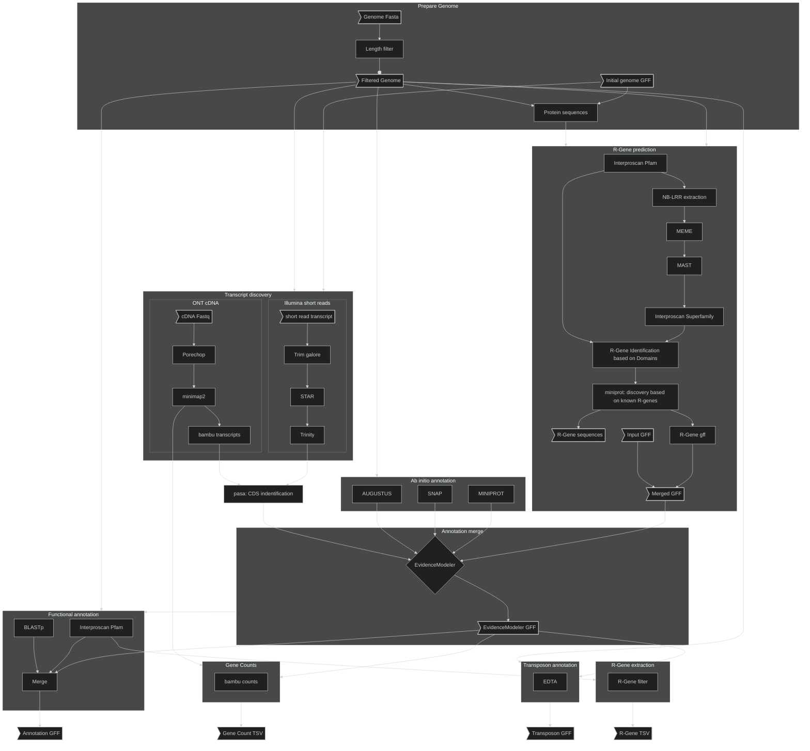
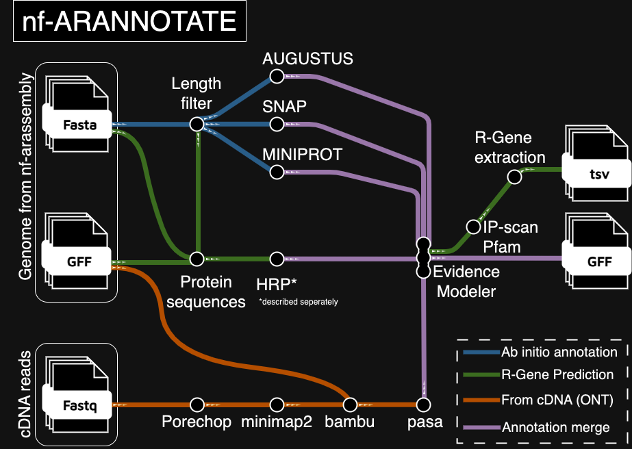

# nf-arannotate

The current recommended workflow for assembly and annotation of _Arabidopsis_ from ONT reads is:

  * Assembly: [`nf-arassembly`](https://gitlab.lrz.de/beckerlab/nf-arassembly)
  * Annotation: This pipeline.

This pipeline is designed to annotate outputs from [`nf-arassembly`](https://gitlab.lrz.de/beckerlab/nf-arassembly).
It takes a samplesheet of genome assemblies, intitial annotations (liftoff) and *cDNA* ONT Nanopore reads.
If `--short_reads` is true it takes short reads instead of long cDNA.


# Usage

To run the pipeline with a samplesheet on biohpc_gen with charliecloud:

```
git clone https://gitlab.lrz.de/beckerlab/nf-arannotate
nextflow run nf-evmodeler --samplesheet 'path/to/sample_sheet.csv' \
                          --out './results' \
                          -profile biohpc_gen
```

# Parameters

| Parameter | Effect |
| --- | --- |
| `--samplesheet` | Path to samplesheet |
| `--porechop` | Run porechop on the reads? (default: `false`) |
| `--exclude_pattern` | Exclusion pattern for chromosome names (HRP, default `ATMG`, ignores mitochondrial genome) |
| `--reference_name` | Reference name (for BLAST), default: `Col-CEN` |
| `--reference_proteins` | Protein reference (defaults to Col-CEN); see known issues / blast below for additional information |
| `--gene_id_pattern` | Regex to capture gene name in initial annoations. Default: ` "AT[1-5C]G[0-9]+.[0-9]+|evm[0-9a-z\\.]*|ATAN.*" ` will capture TAIR IDs, evm IDs and ATAN  |
| `--r_genes` | Run R-Gene prediction pipeline?, default: `true` |
| `--augustus_species` | Species to for agustus, default: `"arabidopsis"` |
| `--min_contig_length` | minimum length of contigs to keep, default: 5000 |
| `--out` | Results directory, default: `'./results'` |

# Samplesheet

Samplesheet `.csv` with header:

```
sample,genome_assembly,liftoff,reads
```

| Column | Content |
| --- | --- |
| `sample` | Name of the sample |
| `genome_assembly` | Path to assembly fasta file |
| `liftoff` | Path to liftoff annotations |
| `reads` | Path to file containing cDNA reads |

If `--short_reads` is used the samplesheet should look like:

```
sample,genome_assembly,liftoff,paired,shortread_F,shortread_R
sampleName,assembly.fasta,reference.gff,true,short_F1.fastq,short_F2.fastq
```

If there is only one type of read shortread_R should be empty and paired should be `false`

# Procedure

This pipeline will run the following subworkflows:
  
  * `SUBSET_GENOMES`: Subset to genome to `params.min_contig_length`
  * `SUBSET_ANNOTATIONS`: Subset input gff to contigs larger than `params.min_contig_length`
  * `HRP`: Run the homology based R-gene prediction
  * `AB_INITIO`: Perform ab initio predictions:
    - `SNAP` https://github.com/KorfLab/SNAP/tree/master
    - `AUGUSTUS` https://github.com/Gaius-Augustus/Augustus (kind of paralellized)
    - `MINIPROT` https://github.com/lh3/miniprot
  * `BAMBU`: Run `porechop` (optional) on cDNA reads and align via `minimap2` in `splice:hq` mode. Then run `bambu`
  * `TRINITY`: Run `Trim Galore!` on the short reads, followed by `STAR` for alignment and `TRINITY` for transcript discovery from the alignment.
  * `PASA`: Run the [PASA pipeline](https://github.com/PASApipeline/PASApipeline/wiki) on bambu output . This step starts by converting the bambu output (.gtf) by passing it through `agat_sp_convert_gxf2gxf.pl`. Subsequently transcripts are extracted (step `PASA:AGAT_EXTRACT_TRANSCRIPTS`). After running `PASApipeline` the coding regions are extracted via `transdecoder` as bundeld with pasa (`pasa_asmbls_to_training_set.dbi`)
  * `EVIDENCE_MODELER`: Take all outputs from above and the initial annotation (typically via `liftoff`) and run them through [Evidence Modeler](https://github.com/EVidenceModeler/EVidenceModeler/wiki). The implementation of this was kind of tricky, it is currently parallelized in chunks via `xargs -n${task.cpus} -P${task.cpus}`. I assume that this is still faster than running it fully sequentially. This produces the final annotations, `FUNCTIONAL` only extends this with extra information in column 9 of the gff file.
  * `GET_R_GENES`: R-Genes (NLRs) are identified in the final annotations based on `interproscan`.
  * `FUNCTIONAL`: Create functional annotations based on `BLAST` against reference and `interproscan-pfam`. Produces protein fasta. Creates `.gff` and `.gtf` outputs. Also quantifies transcripts via `bambu`.
  * `TRANSPOSONS`: Annotate transposons using `EDTA`

The weights for EVidenceModeler are defined in `assets/weights.tsv`

# Outputs

The outputs will be put into `params.out`, defaulting to `./results`. Inside the results folder, the outputs are structured according to the different subworkflows of the pipeline (`workflow/subworkflow/process`). 
All processess will emit their outputs to results.
[`AGAT`](https://github.com/NBISweden/AGAT/) is used throughout this pipeline, hopefully ensuring consistent gff formating.

# Graph

General Graph



Graph for HRP


## Experimental graph

> Below is an attempt using the `gitGraph` in mermaid


# Tubemap




# Pipeline information 

This pipeline performs a number of steps specifically aimed at discovery and annotation of NLR genes.


# Known issues & edge case handling

## Interproscan

Interproscan is run from the interproscan docker image.
The data needs to be downloaded separately and mounted into /opt/interproscan/data (see biohpc_gen.config, https://hub.docker.com/r/interpro/interproscan).
After downloading a new data-release, the container should be run once interactively to index the modles (https://interproscan-docs.readthedocs.io/en/latest/HowToDownload.html#index-hmm-models):

```bash
python3 setup.py interproscan.properties
```

## genblastG

`genblastG` was used in the original HRP publication. `genblastG` produces too many errors to be reasonably used for production tools, `miniprot` is replacing `genblastG` in this pipeline.

## BLAST / AGAT_FUNCTIONAL_ANNOTATION

`agat_sp_manage_functional_annotation.pl` is looking for `GN=` in the headers of the `.fasta` file used as a db for `BLASTP` to assign a **g**ene **n**ame.

Currently, this is handled using `sed` for a very specific case: the annotations that come with [Col-CEN-v1.2](https://github.com/schatzlab/Col-CEN).

The easiest solution would be to correctly prepare the protein fasta in such a way that it contains `GN=` with the appropriate gene names. In that case modules `MAKEBLASTDB` and `AGAT_FUNCTIONAL_ANNOTATION` need to be edited.