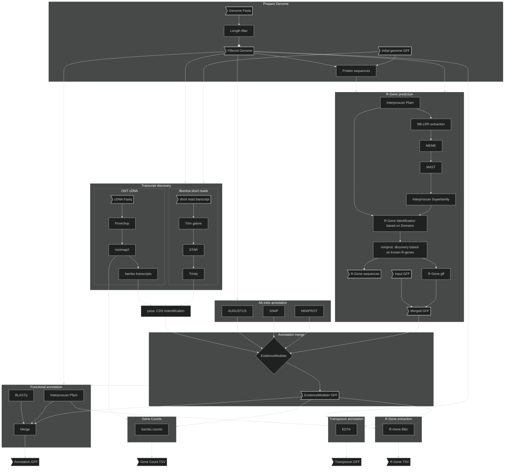

General Graph

```mermaid
%%{init: {'theme': 'dark', "flowchart" : { "curve" : "basis" } } }%%

graph TD;
    subgraph Prepare Genome
      gfasta>Genome Fasta] --> lfilt[Length filter];
      lfilt --o filtfasta>Filtered Genome]
      filtfasta --> pseqs[Protein sequences];
      ggff>Initial genome GFF] --> pseqs;
    end

    subgraph abinitio[Ab initio annotation]
      AUGUSTUS;
      SNAP;
      MINIPROT;
    end

    filtfasta --> abinitio

    subgraph hrp[R-Gene prediction]
        hrppfam[Interproscan Pfam]
        hrppfam --> nbarc[NB-LRR extraction]
        nbarc --> meme[MEME]
        meme --> mast[MAST]
        mast --> superfam[Interproscan Superfamily]
        hrppfam --> rgdomains[R-Gene Identification based on Domains]
        superfam --> rgdomains
        rgdomains --> miniprot[miniprot: discovery based on known R-genes]
        miniprot --> seqs>R-Gene sequences]
        miniprot --> rgff[R-Gene gff]
        ingff>Input GFF] --> mergegff>Merged GFF]
        rgff --> mergegff
    end

    pseqs --> hrp
    filtfasta --> hrp

    subgraph TranscriptDiscover [Transcript discovery]
      subgraph longreads [ONT cDNA]
        cDNA>cDNA Fastq] --> Porechop;
        Porechop --> minimap2;
        minimap2 --> batrans[bambu transcripts];
      end
      subgraph shortreads [Illumina short reads]
        mRNA>short read transcript] --> trim[Trim galore];
        trim --> alnshort[STAR]
        alnshort --> trinity[Trinity]
      end
    end

    filtfasta --> TranscriptDiscover
    ggff --> TranscriptDiscover
    batrans --> pasa[pasa: CDS indentification]
    trinity --> pasa
    pasa --> EvidenceModeler;

    subgraph AnnoMerge [Annotation merge]
      AUGUSTUS --> EvidenceModeler{EvidenceModeler};
      SNAP --> EvidenceModeler;
      MINIPROT --> EvidenceModeler;
      EvidenceModeler --> evGFF>EvidenceModeler GFF]
    end

    mergegff --> EvidenceModeler;

    subgraph counts[Gene Counts]
      bacounts[bambu counts]
    end

    subgraph Rgene[R-Gene extraction]
      rgene[R-Gene filter];
    end

    pfam --> Rgene
    Rgene --> r_tsv>R-Gene TSV];
    minimap2 --> counts;
    evGFF --> counts;
    counts --> tsv_count>Gene Count TSV];

    subgraph FuncAnno [Functional annotation]
      BLASTp;
      pfam[Interproscan Pfam];
      BLASTp --> func[Merge];
      pfam --> func;
    end

    filtfasta --> FuncAnno
    AnnoMerge --> FuncAnno

    evGFF --> func
    func --> gff_anno>Annotation GFF]

    subgraph Transposon[Transposon annotation]
      edta[EDTA]
    end
    filtfasta --> Transposon
    evGFF --> Transposon

    Transposon --> tranposonGFF>Transposon GFF]

```